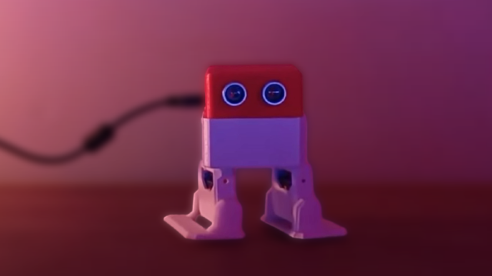

# Terbiyesiz Robot!



Arduino ve 3D baskı malzemelerini bir araya getirerek, Robotumuzun insanları gördüğünde küfür etmesini sağlıyoruz! 🎮✨

[Video Linki](https://www.youtube.com/watch?v=PIouZmYh1Xo)

## Projenin Sitesi
[Projenin Sitesi](https://www.ottodiy.com/)

---

## Malzeme Listesi
- **Arduino Nano**
- **Arduino Nano I/O Sensör Shield**
- **4x Mini Servo Motor**
- **100 Gram Filament**
- **Jumper Kablolar**

---

## 3D Modellerin İndirme Linkleri
- [OttoDIY Modeli](https://www.printables.com/model/31955-otto-diy-build-your-own-robot/files)

---

## Arduino Kodu

```cpp
/***************************************************************************
*                                                                          *
*       Arduino İle Küfür Eden Robot: Kavgada Söylenmez!                   *
*                         BERATRONİK 2024                                  *
*                                                                          *
*       Youtube: https://youtu.be/PIouZmYh1Xo                              *
*                                                                          *
***************************************************************************/            
#include "Otto.h"
Otto Otto;
#include "SoftwareSerial.h"

#define LeftLeg 2 // left leg pin, servo[0]
#define RightLeg 3 // right leg pin, servo[1]
#define LeftFoot 4 // left foot pin, servo[2]
#define RightFoot 5 // right foot pin, servo[3]
#define Buzzer 13 //buzzer pin

SoftwareSerial DFMiniSerial(12, 11);

long ultrasound_distance_simple() {
  long duration, distance;
  digitalWrite(8, LOW);
  delayMicroseconds(2);
  digitalWrite(8, HIGH);
  delayMicroseconds(10);
  digitalWrite(8, LOW);
  duration = pulseIn(9, HIGH);
  distance = duration / 58;
  return distance;
}

void exe_cmd(byte CMD, byte Par1, byte Par2) {
  word check = -(0xFF + 0x06 + CMD + 0x00 + Par1 + Par2);
  byte Command[10] = {0x7E, 0xFF, 0x06, CMD, 0x00, Par1, Par2, highByte(check), lowByte(check), 0xEF};
  for (int i = 0; i < 10; i++) {
    DFMiniSerial.write(Command[i]);
  }
}

void play_random_music() {
  byte music_number = random(1, 5); // Random music number between 1 and 4
  exe_cmd(0x03, 0, music_number); // Play random music
  delay(2000); // Wait for the music to finish (adjust delay time as needed)
  while (DFMiniSerial.available()) { // Wait until the music finishes playing
    DFMiniSerial.read();
  }
}

void check() {
  static unsigned long lastDetectionTime = 0;
  int distance = ultrasound_distance_simple();
  if (distance <= 30 && (millis() - lastDetectionTime) > 5000) {
    play_random_music(); // Play random music if object detected within 30cm and at least 5 seconds have passed since last detection
    lastDetectionTime = millis();
  }
}

void setup() {
  randomSeed(analogRead(0)); // Initialize random number generator
  Otto.init(LeftLeg, RightLeg, LeftFoot, RightFoot, true, Buzzer);
  Otto.home();

  DFMiniSerial.begin(9600);
  delay(1000);
  exe_cmd(0x3F, 0, 0);
  exe_cmd(0x06, 0, 0x1b);
  pinMode(8, OUTPUT);
  pinMode(9, INPUT);
}

void loop() {
  check();
  for (int count = 0; count < 5; count++) {
    Otto.walk(1, 3000, -1); // BACKWARD
    Otto.home();
  }
}
